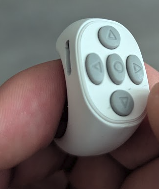

# JX-05 Presenter



A macOS and Windows utility that turns the JX-05 Bluetooth ring remote into a presentation controller.

The JX-05 ring registers as a BLE digitizer/touchpad rather than a keyboard, which means it doesn't work out of the box with presentation software. This tool bridges the gap by reading the ring's raw HID touch events and converting gestures into keystrokes.

Supports five gestures: swipe up, swipe down, swipe left, swipe right, and center tap — all with configurable key mappings.

Works with any presentation tool that supports keyboard navigation: Keynote, Google Slides, PowerPoint, reveal.js, etc.

## Requirements

- macOS (tested on macOS 15+) or Windows 10+
- JX-05 ring remote paired via Bluetooth

## Install

### macOS — Homebrew (recommended)

```bash
brew install savikko/tap/jx05presenter
```

### macOS — From source

```bash
xcode-select --install
git clone https://github.com/savikko/jx05presenter.git
cd jx05presenter
make build
sudo make install
```

### Windows

Download `ringbridge.exe` from the [latest release](https://github.com/savikko/jx05presenter/releases) and place it anywhere on your system.

To build from source (requires [Rust](https://rustup.rs/)):

```bash
cd windows
cargo build --release
```

The binary will be at `windows\target\release\ringbridge.exe`.

## Usage

### macOS

1. Pair the JX-05 ring with your Mac via Bluetooth Settings
2. Start the service:

```bash
brew services start jx05presenter
```

   This runs in the background and starts automatically on login.

3. Open your presentation and use the ring:
   - **Swipe up/down** = Previous / Next slide (Page Up / Page Down)
   - **Swipe left/right** = Left / Right arrow keys
   - **Center tap** = Space bar
   - Try both directions to see which is which — it depends on how you wear the ring

To stop the service:

```bash
brew services stop jx05presenter
```

To run manually instead (foreground):

```bash
ringbridge
```

### Windows

1. Pair the JX-05 ring with your PC via Bluetooth Settings
2. Run `ringbridge.exe` (double-click or from a terminal)
3. Use the ring gestures — same as macOS above

No special permissions are needed on Windows. To run at startup, place a shortcut to `ringbridge.exe` in your Startup folder (`Win+R` → `shell:startup`).

### Accessibility Permission (macOS only)

The first time you press a button on the ring, macOS will show a permission dialog. To enable it:

1. Click **"Open System Settings"** in the dialog
2. In **Privacy & Security > Accessibility**, enable **ringbridge**
3. You may need to restart the service after granting permission:

```bash
brew services restart jx05presenter
```

This is required for the tool to inject keystrokes.

### Troubleshooting: Ring not responding after reconnection

If the ring disconnects (e.g. goes out of range or sleeps) and stops working after reconnecting:

- **v1.7.0+** handles this automatically via hot-plug detection — the service detects the reconnection and re-registers without a restart.
- On older versions, restart the service: `brew services restart jx05presenter`
- Check the log for status: `cat /opt/homebrew/var/log/ringbridge.log`
- If the log shows "JX-05 connected", the ring is working. If it shows "Waiting for JX-05 device...", the ring hasn't fully reconnected via Bluetooth yet.

## How it works

The JX-05 ring presents itself as a BLE digitizer device (HID Usage Page 13) with a circular touchpad. When you swipe around the ring, it sends a stream of X/Y coordinate updates.

This tool:

1. Monitors for HID devices matching the JX-05's product name (hot-plug aware — detects connect/disconnect automatically)
2. Tracks X and Y axis position changes over a 400ms sliding window
3. When it detects significant movement (delta > 800 on a 0-3500 range), it determines the dominant axis (horizontal vs vertical) and fires the corresponding keystroke
4. When a touch ends with minimal movement, it registers as a center tap
5. Applies a 500ms cooldown between gestures to prevent double-triggers

On macOS, keystrokes are injected via `CGEvent`. On Windows, via `SendInput`.

## Configuration

### Key Mappings

Create a config file to customize which keys the ring gestures produce:

- **macOS**: `~/.config/ringbridge/config.json`
- **Windows**: `%APPDATA%\ringbridge\config.json`

```json
{
  "swipe_up": "pageup",
  "swipe_down": "pagedown",
  "swipe_left": "left",
  "swipe_right": "right",
  "tap": "space"
}
```

The values shown above are the defaults. You only need to create this file if you want to change them. Restart after editing:

```bash
# macOS
brew services restart jx05presenter

# Windows — restart ringbridge.exe
```

Available key names: `pageup`, `pagedown`, `left`, `right`, `up`, `down`, `space`, `return`, `escape`, `tab`, `f5`, `f11`, `a`-`z`.

### Tuning

These constants can be adjusted in the source (`ringbridge.swift` on macOS, `windows/src/main.rs` on Windows):

| Constant | Default | Description |
|----------|---------|-------------|
| `COOLDOWN` | `0.5s` / `500ms` | Minimum time between gestures |
| `MIN_SAMPLES` | `4` | Minimum data points before detecting a swipe |
| `SWIPE_THRESHOLD` | `800` | Minimum axis movement to trigger a swipe |
| `TAP_THRESHOLD` | `200` | Maximum movement to register as a tap |

### Debugging

Run with `--debug` to see raw HID events from the ring:

```bash
ringbridge --debug
```

## Upgrade

### macOS

```bash
brew upgrade jx05presenter
brew services restart jx05presenter
```

### Windows

Download the latest `ringbridge.exe` from [releases](https://github.com/savikko/jx05presenter/releases) and replace the old one.

## Uninstall

### macOS — Homebrew

```bash
brew uninstall jx05presenter
```

### macOS — From source

```bash
sudo make uninstall
```

### Windows

Delete `ringbridge.exe` and remove the startup shortcut if you created one.

## License

MIT
